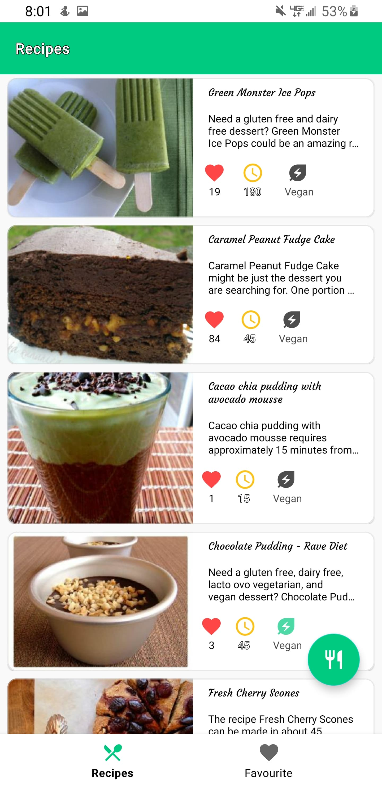
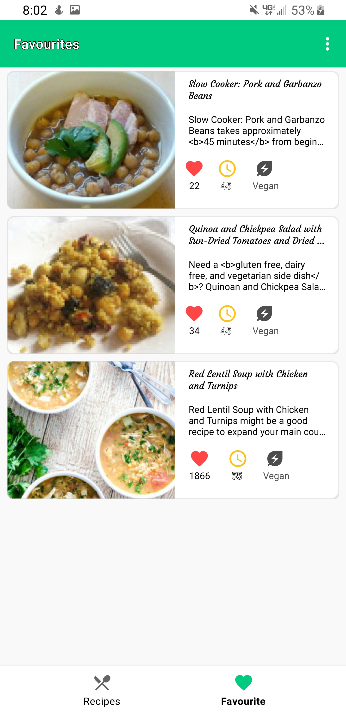

# Recipe App

## Description
The Recipe App is designed to demonstrate the implementation of the Room database, Retrofit, and MVVM architecture in Android development. This app allows users to search, filter, and view recipes, offering a user-friendly interface for culinary exploration. Users can save their favorite recipes for offline access and enjoy a clean, modern UI.

## Features

- **Recipe Search and Filtering:**
  - Filter recipes by meal type (breakfast, lunch, dinner, etc.) and recipe type (vegetarian, vegan, gluten-free, etc.) using a bottom sheet dialog.

- **Recipe Details:**
  - View detailed recipe descriptions, including ingredients, cooking instructions, and preparation time.
  - Save and delete favorite recipes.

- **Local and Remote Data Handling:**
  - Fetch recipes from remote servers using Retrofit.
  - Save recipes locally using Room database for offline access.

- **Modern UI/UX:**
  - Implemented using the latest Android UI components with a focus on a simple and user-friendly design.
  - Shimmer effect for loading placeholders and Coil for efficient image loading.

## Technologies Used

- **Kotlin:** Primary programming language used for Android development.
- **XML:** Utilized for designing UI layouts.
- **Room:** Local database for storing favorite recipes and offline access.
- **Retrofit:** For network requests and remote data fetching.
- **Hilt:** Dependency injection framework to manage app dependencies.
- **MVVM:** Architecture pattern used to structure the application, promoting separation of concerns and improving code maintainability.
- **Shimmer:** For adding shimmer effect during data loading.
- **Coil:** For efficient image loading and caching.
- **JSoup:** For extracting HTML-based data from web pages.
- **Coroutines:** For managing asynchronous tasks.

## API Used

- **Spoonacular API:** The Spoonacular API is used for fetching recipe data, including ingredients, instructions, and nutritional information. The API provides a wide variety of recipes and allows filtering based on dietary preferences and meal types.

## How to Get an API Key

1. **Visit Spoonacular's Website:**
   - Go to the [Spoonacular API website](https://spoonacular.com/food-api).

2. **Sign Up or Log In:**
   - If you don't have an account, sign up for a free account. If you already have one, log in.

3. **Navigate to the API Key Section:**
   - Once logged in, navigate to the API key section of your account dashboard.

4. **Generate Your API Key:**
   - Follow the instructions to generate a new API key. You may need to agree to the terms of service.

5. **Copy Your API Key:**
   - Copy the API key to use it in your application.

6. **Replace the API Key in Your Project:**
   - Navigate to the `util` Package.
   - Locate the `constants` file.
   - Replace the existing placeholder or API key with your new API key in the file:
     ```properties
     API_KEY=your_api_key_here
     ```

7. **Update Your Code to Use the API Key:**
   - Ensure that your Retrofit setup and other network configurations in your code reference this key securely.

   - Make sure to keep your API key secure and do not share it publicly.

### Important Notes

- **API Usage Limits:** The free plan offers a limited number of requests per day. Check the Spoonacular API documentation for details on usage limits and pricing.
- **Security:** Do not commit your API key to version control systems. Use environment variables or configuration files to manage sensitive information securely.

## Screenshots



## Installation

To set up the project locally, follow these steps:

1. **Clone the Repository:**
    ```sh
    git clone https://github.com/awais1019/Recipe-App.git
    ```

2. **Open the Project in Android Studio:**
    - Launch Android Studio.
    - Select "Open an existing Android Studio project."
    - Navigate to the cloned repository and select it.

3. **Replace the API Key:**
   - Open the `constants` file in the `util` folder.
   - Replace the placeholder API key with your actual API key as described in the [How to Get an API Key](#how-to-get-an-api-key) section.

4. **Build the Project:**
    - Android Studio will automatically download the necessary dependencies.
    - Click `Build > Make Project` or press `Ctrl+F9`.

5. **Run the App:**
    - Connect an Android device or start an emulator.
    - Click `Run > Run 'app'` or press `Shift+F10`.

## Contributing

Contributions are welcome! If you have suggestions or improvements, please open an issue or submit a pull request.

## Acknowledgments

The project was inspired by various resources and practices observed in Android development courses. Significant parts of the implementation draw from common patterns and techniques used in modern Android apps.

## Contact Information

For any questions or feedback, please contact:

- **Email:** mhawais504@gmail.com
- **GitHub:** [awais1019](https://github.com/awais1019)
